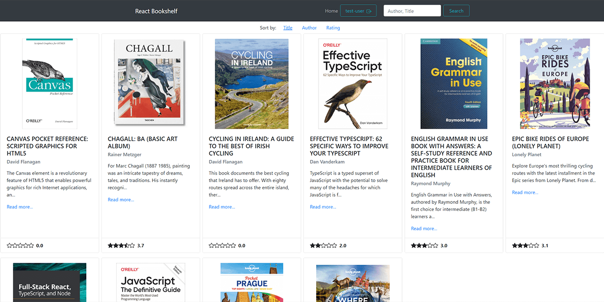

# React Bookshelf
**A sample frontend project on React-TypeScript-Redux**

A frontend for a sample electronic library application with pagination, search, sorting and authentication.

* Current live version at [https://zen-austin-25d292.netlify.app](https://zen-austin-25d292.netlify.app)

---
## Features

* Books are loaded from a JSON file into a global state (database emulation)
* If there are more than 10 books to load, a pagination at the bottom of the page appears
* Users can search the library by an author or by a title (search for both fields in one query)
* Users can sort the library by a title, by an author, or by rating
* The main library page features a basic info of every book and a rating, authenticated users can vote here
* A click on a cover or on a 'Read more' link leads to a single book page view
* A single book is loaded from a JSON file (not from a state, hence edits are not saved globally)
* There is a detailed info on a single book page, as well as comments section
* Authenticated users can vote, leave comments or edit info of the book they added (user ID is set as 'owner' in the mock database)
* Users can log in/log out by the link of the top of the page (test id: *test-user*, test password: *12345*). Credentials are hardcoded into a global state. Errors are shown, if the username or the password is incorrect.
* Authentication is checked by a token created in a browser during the successful sign in.

## Updates

* 29.05.2021 - total Redux store refactor, now it's on hooks with Toolkit

## Technology

* React (functional components, hooks, router)
* Redux (hooks, toolkit)
* TypeScript
* JavaScript (ES6)
* Bootstrap (bootstrap-react)
* Airbnb-typescript ESLint codestyle

## To Do
* Ascending/Descending sorting by multiple clicks
* A separate '/search' route
* A '/category' route
* Forms validation
* Ability to delete comments
* Ability to add new books
* Refactoring
* Design improvements
